# Análisis y comparación de protocolos para el control de flujo y congestión en redes utilizando simulación discreta

## Resumen
En este informe se analiza y compara un protocolo de control de flujo y congestión en redes de computadoras con el comportamiento de la red sin la utilización del protocolo, utilizando simulación discreta. El protocolo implementado por nosotros es un protocolo simple que llamaremos "¡Para la mano!" y los resultados obtenidos muestran que obtenemos resultados muy buenos evitando la perdida de paquetes en los casos de prueba realizados.

## Introducción

### Control de flujo y congestión
El control de flujo y congestión en redes de computadoras son dos problemas que se presenta cuando se envían datos a través de una red compartida. Trabajaremos estos problemas desde el punto de vista de la capa de transporte del modelo OSI o TCP/IP.

El problema de control de flujo en la capa de transporte surge cuando un emisor envía datos a un receptor más rápido de lo que este puede procesarlos. El receptor debe informar al emisor que reduzca la velocidad de envío de datos ya que los datos que no puede procesar serán descartados y se perderá información.

El problema de control de congestión en la capa de transporte surge cuando un emisor envía datos a una red más rápido de lo que esta puede transmitirlos. La red debe informar al emisor que reduzca la velocidad de envío de datos ya que los datos que no puede transmitir serán descartados y se perderá información.

### Metodología de trabajo 
Para analizar y comparar el protocolo de control de flujo y congestión con el comportamiento de la red sin la utilización del protocolo, utilizaremos simulación discreta. 

La simulación discreta es una técnica de modelado de sistemas dinámicos en la que el tiempo avanza en forma discreta. En este tipo de simulación, el tiempo se divide en intervalos de tiempo y el estado del sistema se actualiza al final de cada intervalo. Las simulaciones se realizan en un ordenador mediante Omnett++, un entorno de simulación de eventos discretos, donde se modela el comportamiento de una red simplificada y se analiza el comportamiento de la red con y sin el protocolo de control de flujo y congestión. 

### Análisis de los problemas
Nosotros evaluaremos el problema de control de flujo y control de congestión mediante 2 casos de pruebas:
1. Caso 1: Se envían paquetes desde un emisor a un receptor a través de una red con un buffer intermedio. El emisor envía paquetes a una velocidad mayor a la que el receptor puede procesarlos. Este caso es un problema de control de flujo.
2. Caso 2: Se envían paquetes desde un emisor a un receptor a través de una red con un buffer intermedio. El emisor envía paquetes a una velocidad mayor a la que la red (en este caso el buffer intermedio) puede transmitirlos. Este caso es un problema de control de congestión.

A continuación se muestran imágenes extraidas del libro "Redes de Computadoras" de Tanenbaum que representan los problemas de control de flujo y congestión de una manera más visual e intuitiva y ayudan a distinguir mejor las diferencias entre ambos problemas.

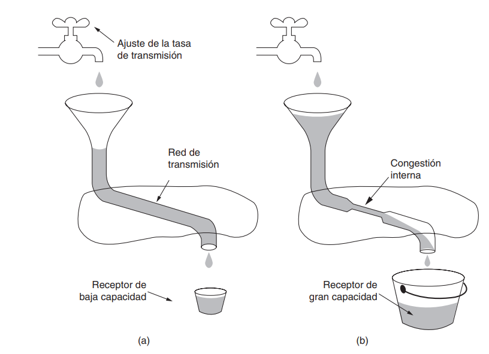
(a) Una red veloz que alimenta a un receptor de baja capacidad. (b) Una red lenta que alimenta a un receptor de alta capacidad.

La estructura que utilizaremos para evaluar el comportamiento de la red sin el protocolo es la siguiente:

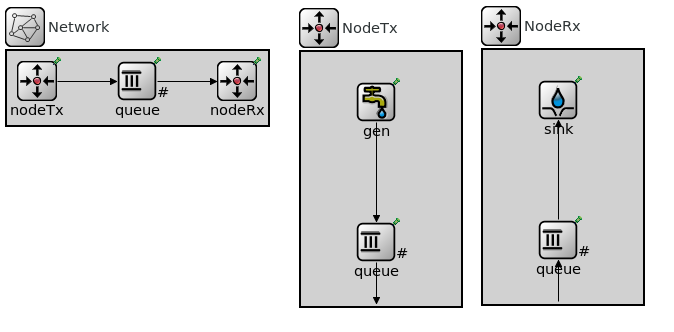

El funcionamiento de la red es muy básico, el generador genera paquetes que envia al queue de Tx, el cual esta conectado a otro queue intermedio, el cual le envia al queue Rx que esta conectado al recolector. 

Para el caso 1 y caso 2 se modifican las tasas de transferencia de las conexiones entre colas, y los valores que se colocan dependen del caso de prueba que se quiera modelar. 

La cola intermedia y la cola Rx tienen un tamaño de buffer de 200 paquetes, y la cola conectada con el generador tiene un tamaño de buffer de 2000000 paquetes. La razón de esto es que no nos interesa evaluar el comportamiento de la red cuando se llena el buffer del generador, ya que eso no es un problema de control de flujo o congestión, sino que es un problema interno/de configuración del generador.

El tamaño de los paquetes en todos los casos de prueba será de 12500 bytes, y el tiempo de simulación será de 200 segundos.

### Caso 1 - Problema de control de flujo

Para este caso se establecieron las siguientes tasas de transferencia:
Entre la cola Rx y el recolector: 0.5Mbps
Todas las otras conexiones: 1Mbps

Esta claro que la cola Rx es el cuello de botella de la red, ya que es la que tiene la menor tasa de transferencia y recibirá paquetes a una velocidad mayor a la que puede procesarlos.

Se realizaron varias pruebas variando entre los siguientes intervalos de generación de paquetes: 0.1, 0.15 y 0.2. 

Se obtuvieron los siguientes resultados:

| Intervalo de generación de paquetes | Paquetes enviados | Paquetes recibidos | Paquetes Dropeados | Delay promedio |
|-------------------------------------|-------------------|--------------------|-------------------|----------------|
| 0.1                                 | 1979              | 998               | 770                 | 32.879 s        |
| 0.15                                | 1307              | 998               | 108                 | 23.628 s         |
| 0.2                                 | 989               | 976                | 0                 | 2.398 s         |

La suma entre la cantidad de paquetes recibidos y la cantidad de paquetes dropeados es menor a la cantidad de paquetes enviados. Esto se debe a que al finalizar la simulación, los paquetes que no llegaron a destino por estar almacenados en un buffer intermedio (o estarse transmitiendo en ese momento) no son contabilizados ni como paquetes dropeados ni como paquetes recibidos.

A continuación gráficos que representan el comportamiento de la red en el caso 1, variando el intervalo de generación de paquetes:

| 0.1 | 0.15 | 0.2 |
|-----|-----|-----|
| 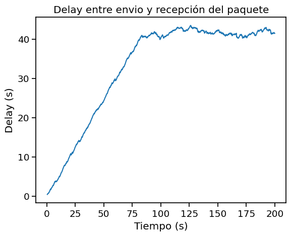   | 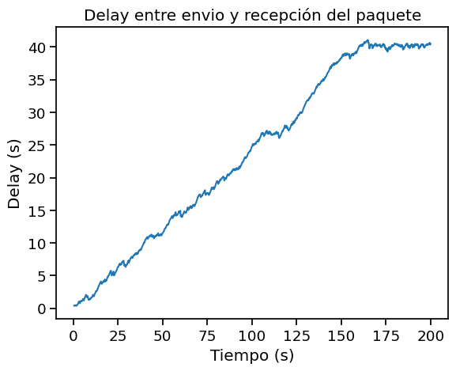   |    |
| 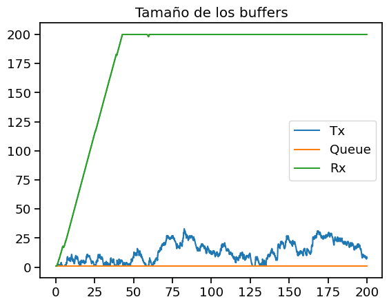   | 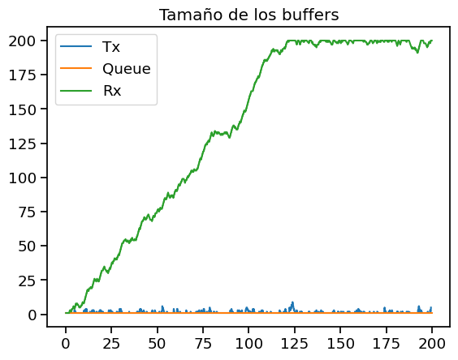   | 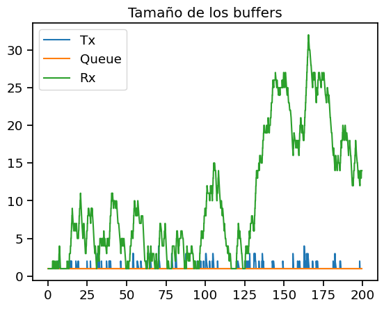   |
| 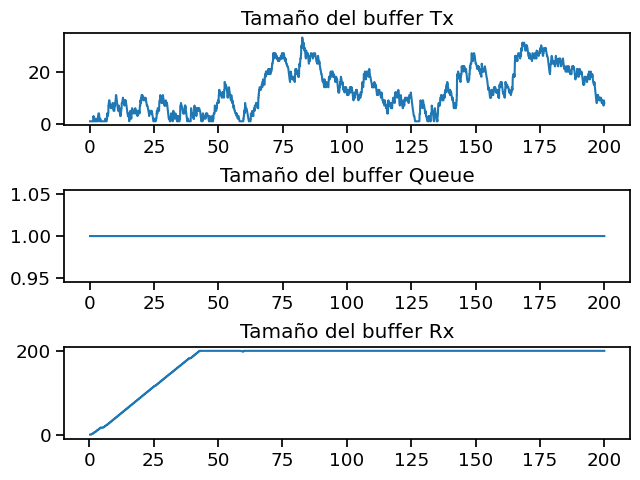   | 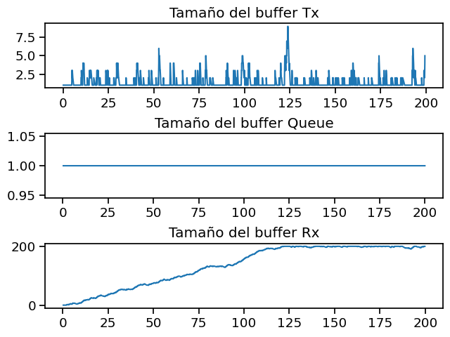   | 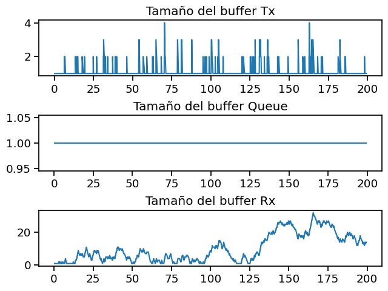   |

Como se puede ver en los gráficos y en la tabla anterior, mientras menor cantidad de paquetes se genera por segundo (mayor intervalo de generación de paquetes), menor es el delay promedio y menor es la cantidad de paquetes dropeados/perdidos. Esto se debe a que al haber menos paquetes en la red, le da tiempo suficiente al receptor para procesarlos sin que se llene el buffer, como podemos ver en la tabla y en los gráficos de la cantidad de paquetes en los buffers del emisor, receptor y en la cola intermedia. Un intervalo de generación de paquetes menor a 0.15 genera perdida de paquetes y bastante demora en la entrega de los paquetes, mientras que un intervalo de generación de paquetes mayor a 0.2 genera una entrega de paquetes rápida y sin perdida de paquetes, aunque la cantidad total de paquetes que se reciben será menor a la anterior.

En los gráficos de tamaño de los buffers podemos ver porque el caso 1 es el relacionado al control de flujo, ya que el buffer del receptor es el que se llena primero, generando el cuello de botella explicado en en análisis de los problemas realizado en la introducción. Es más. se puede ver una clara relación entre la demora en entregar el paquete y el tamaño del buffer del receptor en los 3 casos que se analizaron, reforzando la idea de que el receptor es el que genera el cuello de botella en la red.

[GRAFICO CARGA TRANSMITIDA Y RECIBIDA]

### Caso 2 - Problema de control de congestión

[COMPLETAR AGREGANDO ANALISIS DE LOS PROBLEMAS OBSERVADOR EN CASO 1 Y CASO 2 TAREA DE ANALISIS] 

### Comparación de los casos 1 y 2

[RESPONDER CONSIGAS DEL ENUNCIADO]

## Métodos

El algoritmo que proponemos para resolver ambos problemas es el siguiente:
Cuando algún nodo de la red (el queue intermedio o el queue Rx) detecta que su buffer está cerca de llenarse, envía un aviso al nodo emisor (en este caso el queue Tx) para que disminuya la tasa de transferencia de paquetes. El nodo emisor recibe el aviso y disminuye la tasa de transferencia de paquetes a la mitad. Cuando el nodo que envió el aviso detecta que su buffer está en un nivel aceptable, envía un aviso al nodo emisor para que aumente la tasa de transferencia de paquetes nuevamente. El nodo emisor recibe el aviso y aumenta la tasa de transferencia de paquetes al doble. Este proceso se repite hasta que la simulación finaliza.

Suponemos que el nodo emisor tiene un buffer infinito (o muy grande), por lo que no se puede llenar. Por lo tanto, el nodo emisor no envía avisos a ningún otro nodo de la red.

Esperamos que con este algoritmo se resuelvan los problemas de control de flujo y de control de congestión, ya que al disminuir la tasa de transferencia de paquetes cuando el buffer está cerca de llenarse, se evita que se llene y se generen perdidas de paquetes. Además, al disminuir la tasa de transferencia de paquetes, se disminuye la cantidad de paquetes en la red, por lo que se evita que se genere congestión en la red.

Para que esta solución pueda llevarse a cabo, ese necesario un canal de feedback entre los nodos de la red. Por ello la estructura de la red se vio modificada y quedo de la siguiente manera:

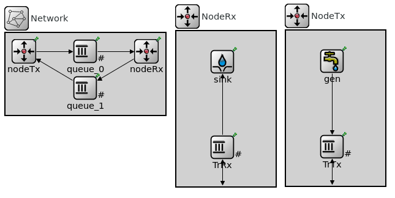

### Implementación

Para poder implementar el algoritmo propuesto, además de la modificación recientemente mostrada, se tuvieron que realizar las siguientes modificaciones:
- En las colas queue_0 y la cola TrRx se agregó un campo de tipo bool que informa si se envio un aviso al nodo emisor para que disminuya la tasa de transferencia de paquetes.
- Se estableció el umbral máximo al 80% para enviar el aviso de disminuir la tasa de transmisión al nodo emisor.
- Se estableció el umbral mínimo al 30% para enviar el aviso de aumentar la tasa de transmisión al nodo emisor.
- Se utiliza la función `setKind` para modificar el tipo de paquete que se envía al nodo emisor, de esta manera el nodo emisor sabe si debe aumentar o disminuir la tasa de transferencia de paquetes. En esta implementación los paquetes de tipo 2 son los que indican que se debe disminuir la tasa de transferencia de paquetes y los paquetes de tipo 3 son los que indican que se debe aumentar la tasa de transferencia de paquetes.
- Se modificó el método `handleMessage` de los nodos queue_0 y TrRx para que envíen el aviso al nodo emisor cuando corresponda.
- Como el nodo queue_0 no tiene un canal de feedback con el nodo emisor, el aviso se envia al nodo TrRx, que es el que tiene el canal de feedback con el nodo emisor. Cuando el nodo TrRx recibe un paquete de tipo 2 o tipo 3 lo envía al nodo emisor mediante el canal de feedback que utiliza a la queue_1. Luego el nodo emisor recibe el paquete y aumenta o disminuye la tasa de transferencia de paquetes según corresponda.

## Resultados
[COMPLETAR AGREGANDO RESULTADOS DE LA SIMULACION Y COMPARACION DE LOS RESULTADOS CON EL COMPORTAMIENTO ESPERADO Y CON EL COMPORTAMIENTO SIN EL PROTOCOLO]
[COLOCAR RESULTADOS PRELIMINARES, PEQUEÑAS MODIFICACIONES QUE SE HICIERON AL ALGORITMO Y RESULTADOS FINALES]
[PONER RESULTADOS CASO 3]

## Discusión
[COMPLETAR CON LOGROS, DIFICULTADES, LIMITACIONES Y POSIBLES MEJORAS DEL PROTOCOLO]

## Referencias
[COMPLETAR CON LAS REFERENCIAS UTILIZADAS, BIBLIOGRAFIA, LIBROS, VIDEOS, PAGINAS CON FECHA DE CONSULTA, ETC]

